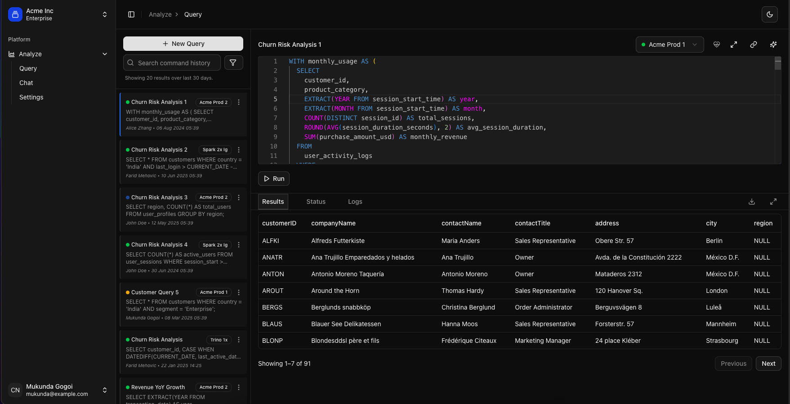
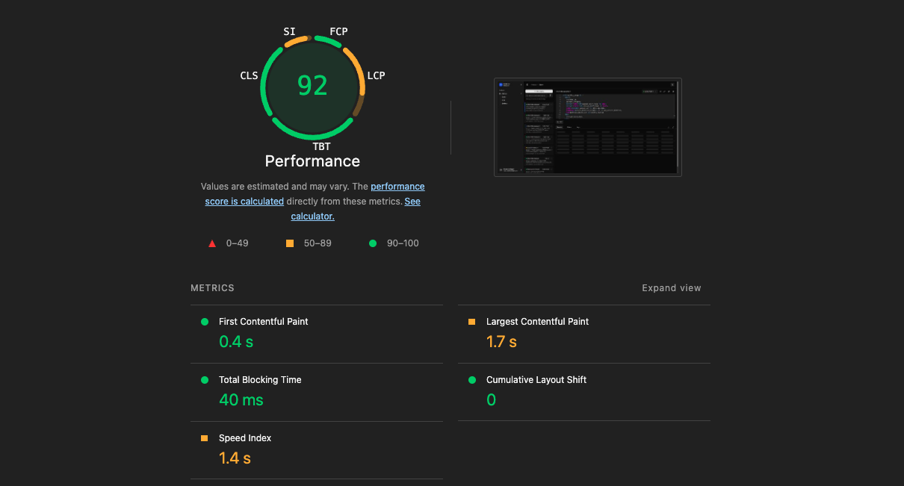

# 🧠 Atlan Frontend Engineering Assignment – SQL Query Runner

This is a web-based SQL playground built as part of the Atlan Frontend Engineering Task. It allows users to input, run, and manage SQL queries, simulating the query experience, The UI is inspired by real-world tools used by data analysts.



## 🚀 Live Demo

🔗 [Deployed on Vercel](https://atlan-challenge-demo.vercel.app/analyze/query)

## 📽️ Demo Video (Under 3 minutes)

🎥 [Walkthrough Demo](https://drive.google.com/file/d/1O68RcoXmCTsUKPaJHCpXTGZsbBgxo3qu/view?usp=sharing)

---

## ⚙️ Tech Stack

- **Framework**: [Next.js](https://nextjs.org/)
- **UI Library**: [shadcn/ui](https://ui.shadcn.dev/)
- **State Management**:
  - React Context API (for global UI state)
  - [@tanstack/react-query](https://tanstack.com/query/latest) (for async query handling and cache)
- **Code Editor**: Monaco Editor
- **Table Renderer**: Virtualized list rendering using native optimization
- **Icons**: [lucide-react](https://lucide.dev/)
- **Styling**: Tailwind CSS

---

## ✨ Features

### ✅ Core Functionality

- 📄 **SQL Code Editor** with syntax highlighting
- 🧾 **Query Execution Output** rendered in a virtualized table
- 🕒 **Query History Viewer** with timestamp and user metadata
- 💾 **Downloadable Results** (CSV export)
- 💡 **Execution Indicators** (active/running status, error state)
- 🎹 **Keyboard Shortcuts** CMD/CTR + Enter to run query 

### 💎 Advanced Features

- 🧠 **AI Query Insight Agent** (Suggests optimization tips for queries)
- 🎯 **Runtime Selector** (Choose between environments like Acme Prod, Spark, etc.)
- 🧹 **Filters** and contextual result manipulation
- 🔗 **Sharable Query Links**
- 📊 **Runtime Metrics** (CPU, memory utilization)
- ⌨️ **Keyboard Shortcuts**
- 🔍 **Autocomplete for SQL Syntax**
- ⚠️ **Query Errors + Debug Logs**
- ❌ **Cancel Query Execution**
- 🔁 **Clone Query**
- 🖥️ **Fullscreen Mode for Editor & Results**
- 🧭 **Breadcrumb Navigation**
- 🌓 **Dark/Light Theme Support**
- ✏️ **Inline Editable Query Names**
- 🗑️ **Delete Query**
- 🎨 **SQL Syntax Highlighting**

## 🗂️ Folder Structure

```bash
pixel/
├── app/                    # Next.js app entry
├── components/
│   ├── common/             # Shared components (breadcrumbs, loading skeletons, status indicators)
│   └── ui/                 # UI building blocks from shadcn/ui
├── constants/              # App-wide constants
├── data/                   # Mock datasets and query results
├── features/
│   ├── analyze/            # Query writing and result display
│   │   ├── api/            # Mock API handlers
│   │   ├── components/     # Editor, result table, toolbars, history panel
│   │   ├── lib/            # Utility logic
│   │   ├── providers/      # Analyze-specific context/state
│   ├── chat/               # AI assistant (query insight agent) - NOT IMPLEMENTED
│   └── common/             # Shared between features
├── hooks/                  # Custom React hooks
├── lib/                    # Utility functions and integrations
├── providers/              # Global app-level context providers
├── public/                 # Static assets
├── types/                  # TypeScript types
```

## 🧪 Performance - Benchmarked using lighthouse and chrome dev tools
###  Page load time measured using chrome dev tools


### Lighthouse score


## ⚡ Performance Optimizations
- Preconnect for CDN saving ~100ms

### 🔄 Optimizations
- Lazy loading Monaco editor
- Virtualized rendering of table rows to support large datasets (tested with 10K+ rows)
- Cached queries and results with `react-query`

### 🧠 Additional Ideas and Optimizations (Not Implemented, not enough time)
- i18n support
- Table autocomplete, user sees a list of tables he can select to query as autocomplete
- View of All databases and tables accessable to the user for querying on the left panel
- Query collections
- Real-time collaboration
- Query versioning and git-like diff
- Chat interface for quering in natural languages eg: "Give me sales report from past 30 days"
